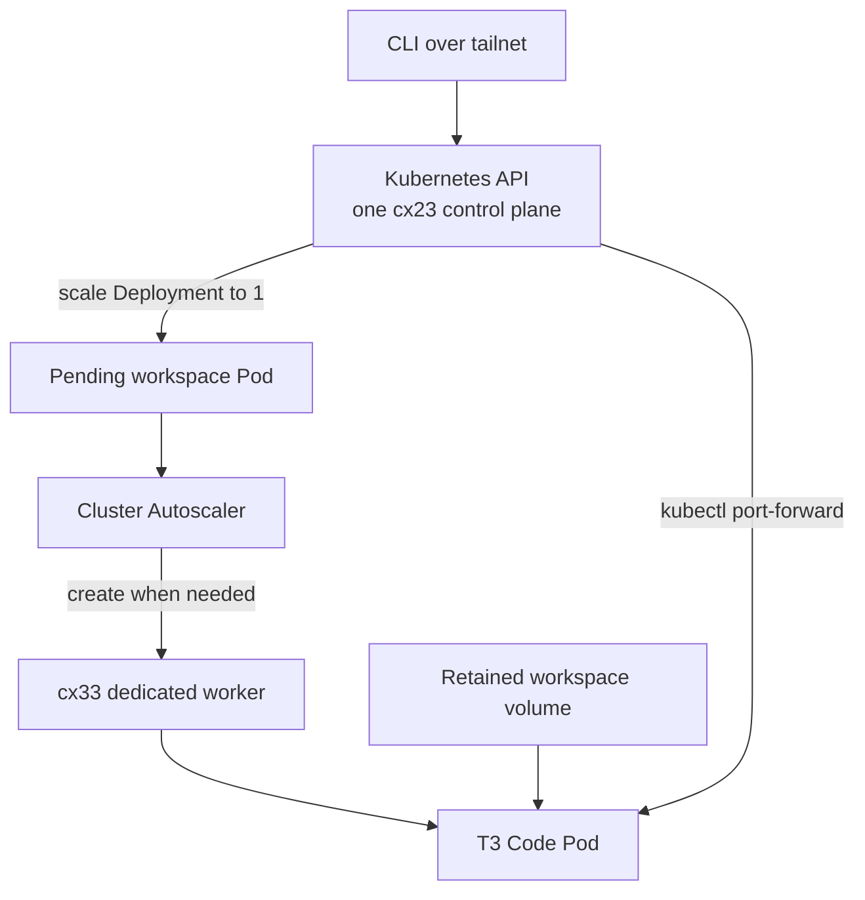
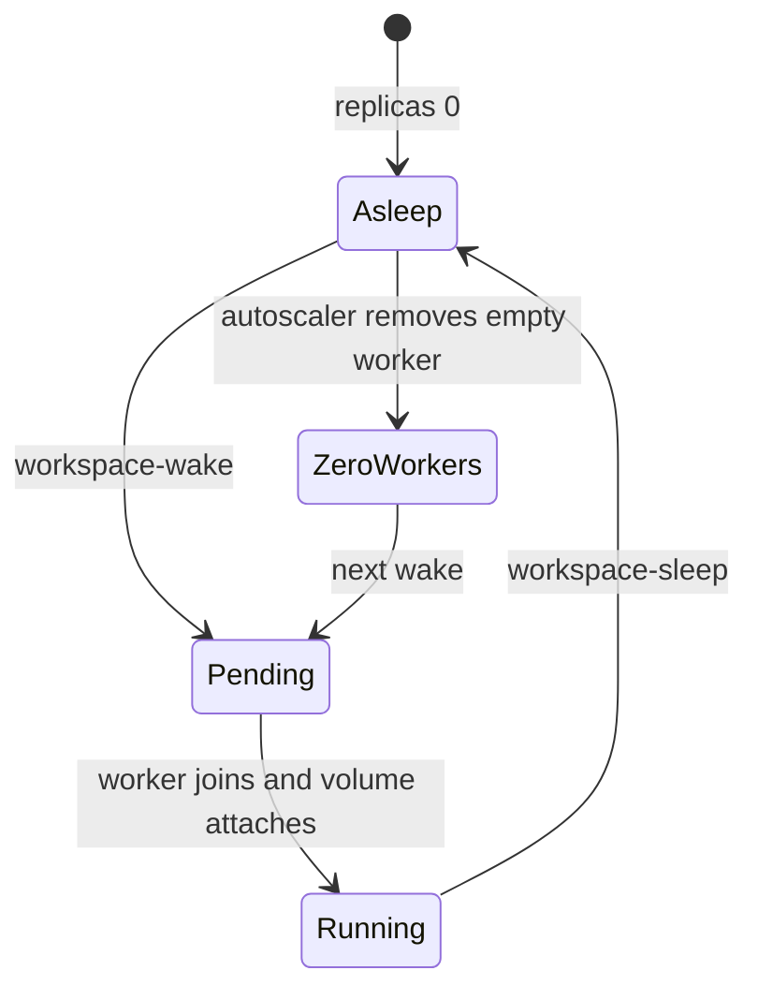

# Remote development candidate cluster

This Terraform root creates the Kube-Hetzner candidate from
[ADR 012](../../ui/content/projects/agent-friendly-remote-development/adrs/012-kube-hetzner-evaluation.mdx).
It has separate Terraform state and uses a separate Hetzner project. It does
not read or change the current remote-development VPS.

## Topology

The cluster keeps one `cx23` control plane in `nbg1` online. A `cx33` worker
pool scales from zero to two nodes. The control plane runs the Kubernetes API,
Cluster Autoscaler, and system services, but never tenant workspaces.



Operator and pilot workspaces start with zero replicas. Every workspace Pod has
a hard anti-affinity rule covering all namespaces. Two tenant workspaces cannot
share a node. The autoscaler pool also has a `NoSchedule` taint, so unrelated
workloads cannot use tenant workers.

Cluster system DaemonSets still run on each worker. The tenancy promise is one
user workspace per worker, not an empty Kubernetes host. After a workspace
stops, the autoscaler deletes its worker. A later user gets a newly created
server rather than the previous tenant's local disk.



Each workspace requests a 90 GiB Hetzner CSI volume with `Retain` reclaim
policy. T3 state, authentication homes, and worktrees live there. The 20 GiB
cache is disposable. Hibernation restarts processes, so it preserves files and
recorded session history but not live terminals or in-memory state.

K3s encrypts Kubernetes Secrets in etcd. It uploads a compressed snapshot every
six hours to external S3-compatible storage and retains 14 snapshots. Workspace
data needs its own backup because etcd snapshots do not contain volume data.

## Prerequisites

Create these resources before the first plan:

1. A separate Hetzner project and read/write API token.
2. Terraform Cloud workspace `personal-site-remote-development-cluster` with
   local execution. It already exists.
3. A Tailscale OAuth client allowed to create
   `tag:remote-dev-control-plane` and `tag:remote-dev-agent` devices. Tailnet
   policy must allow the operator to reach the control plane on TCP 22 and
   6443, and allow the tagged cluster nodes to communicate.
4. An S3-compatible bucket with credentials restricted to the
   `remote-development-candidate/` prefix.
5. Doppler config `homelab/prd_remote_development_cluster` with these values:

   | Name | Exposure | Purpose |
   | --- | --- | --- |
   | `HCLOUD_TOKEN` | secret | Candidate Hetzner project |
   | `TF_API_TOKEN` | secret | Candidate Terraform Cloud workspace |
   | `SSH_PUBLIC_KEY` | plain | Recovery public key |
   | `SSH_PRIVATE_KEY` | secret | Provisioner key, or omit with `ssh-agent` |
   | `LEAPMICRO_X86_SNAPSHOT_ID` | plain | Image ID written by the snapshot task |
   | `TAILSCALE_OAUTH_CLIENT_SECRET` | secret | Tagged node enrolment |
   | `TAILSCALE_MAGICDNS_DOMAIN` | plain | Tailnet `*.ts.net` domain |
   | `ETCD_S3_ENDPOINT` | plain | Snapshot endpoint |
   | `ETCD_S3_ACCESS_KEY` | secret | Bucket-scoped key ID |
   | `ETCD_S3_SECRET_KEY` | secret | Bucket-scoped secret |
   | `ETCD_S3_BUCKET` | plain | Snapshot bucket |
   | `ETCD_S3_REGION` | plain | S3 region, normally `auto` for R2 |

Do not commit kubeconfigs or credentials. Terraform state contains bootstrap
material and must remain restricted.

## Create and verify

Run tasks through mise from the repository root:

```bash
mise run //infra/remote-development-cluster:check
mise run //infra/remote-development-cluster:snapshot
mise run //infra/remote-development-cluster:plan
mise run //infra/remote-development-cluster:apply
mise run //infra/remote-development-cluster:kubeconfig
mise run //infra/remote-development-cluster:deploy-workspaces
mise run //infra/remote-development-cluster:verify
```

Review `.planfile` before applying it. The snapshot task builds the pinned Leap
Micro image once per reviewed Kube-Hetzner update.

The verification task requires both workspaces to start asleep. It wakes them
together, proves that the autoscaler creates two different workers, checks both
volumes, then sleeps them and waits for the worker pool to return to zero.

## Use a workspace

The short path wakes a workspace and forwards T3 Code to localhost:

```bash
mise run //infra/remote-development-cluster:workspace-connect -- operator
```

Open `http://127.0.0.1:3773`. The pilot workspace defaults to port 3774:

```bash
mise run //infra/remote-development-cluster:workspace-connect -- pilot
```

Pass a third argument to choose another local port. `Ctrl-C` closes the tunnel
but leaves the workspace running. Stop active agents and terminals, then sleep
the workspace explicitly:

```bash
mise run //infra/remote-development-cluster:workspace-sleep -- operator
```

Other commands are available when no tunnel is needed:

```bash
mise run //infra/remote-development-cluster:workspace-wake -- operator
mise run //infra/remote-development-cluster:workspace-status -- operator
```

The wrappers run these Kubernetes operations:

```bash
kubectl -n t3-operator scale deployment/t3-code --replicas=1
kubectl -n t3-operator rollout status deployment/t3-code --timeout=10m
kubectl -n t3-operator port-forward service/t3-code 3773:3773
kubectl -n t3-operator scale deployment/t3-code --replicas=0
```

A pending Pod is the demand signal. Cluster Autoscaler sees that the Pod needs
a tainted workspace node and creates one. The first wake normally takes longer
than reconnecting to a running workspace because Hetzner must create the server,
K3s must join it, and CSI must attach the volume.

There is no automatic idle detector yet. Forgetting the sleep command leaves
the worker bill running until Hetzner's monthly price cap.

## Single-control-plane recovery

One control plane is intentionally not highly available. If it reboots, running
workspaces may continue, but `kubectl`, port forwarding, scheduling, and
autoscaling remain unavailable until it returns. Automatic OS upgrades are
disabled so maintenance happens at a chosen time.

If the server is lost, recreate it with Terraform and restore an external etcd
snapshot using the original K3s server token. The token must be backed up with
the snapshot credentials. If cluster state can be rebuilt from Git, reapply the
manifests and reconnect the retained volumes instead. Test both recovery paths
before storing irreplaceable workspace data.

If Tailscale enrolment fails, use the Hetzner browser console. Do not open SSH
or the Kubernetes API to `0.0.0.0/0` as a workaround.

## Cost

These are Hetzner list prices from 2026-09-29, before VAT. They include one
public IPv4 per running server and exclude S3 usage and outbound overages.

| State | Monthly equivalent |
| --- | ---: |
| One control plane, one retained 90 GiB workspace, no worker | €11.14 |
| One control plane, two retained workspaces, no workers | €16.29 |
| One control plane, one continuously running worker, one volume | €20.13 |
| One control plane, two continuously running workers and volumes | €34.27 |
| Two independent `cx33` VPSs with 100 GiB each | €29.42 |

For one user, this design beats a €14.71 VPS when its worker runs for less than
about 248 hours per month. With two users it breaks even when each dedicated
worker averages less than about 456 hours per month. Hetzner bills stopped
servers, so only deletion by the autoscaler stops worker compute charges.

The control plane itself cannot scale to zero because it receives the wake
command and runs the autoscaler.

## Destroy

```bash
mise run //infra/remote-development-cluster:destroy-plan
mise run //infra/remote-development-cluster:destroy
```

Review `.destroy-planfile`. The storage class retains workspace volumes. Export
or delete them separately after checking their backups.
